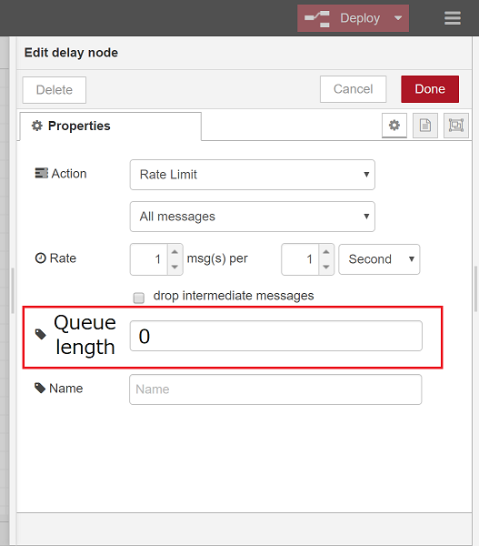

# delay node enhancements
## Summary
 The enhancements for delay node change message queue handling and provide logging function.

## Author
 @kazuhitoyokoi

## Details
### Use cases
#### 1. Incoming message control
 Because Node-RED accepts all incoming message from input nodes like mqtt-in node, Node.js process sometimes reaches the upper limit of memory usage.
To avoid the risk of message queue overflow, rate limit functionality in delay node will be useful but Node-RED users cannot customize queue handling.
For example, the current delay node cannot simultaneously use the drop option and queue to process burst incoming messages.

#### 2. Logging and error handling
 Because current drop option in rate limit mode doesn't record dropped messages, Node-RED users aren't aware of the lost messages.
Therefore, it will be useful for Node-RED users to track background behaviors if the delay node outputs the number of dropped messages to the log stream.
Additionally, Node-RED users can add their error handling in their flow if the delay node throws the dropped messages to the catch node when the queue reaches the defined limit.

#### 3. Changing properties on demand
 Currently, the delay node supports msg.delay to change property value on demand.
If the delay node additionally supports msg.rate to set rate value and msg.queueLength to change queue size, users can create custom delay node using subflow to wrap delay node.

### Options in setting.js which the delay node uses
- nodeMessageBufferMaxLength *[Existing option]*

  The enhanced delay node supports nodeMessageBufferMaxLength as the default buffer length.
  The buffer length needs to be greater than queue length defined in msg.queueLength or node property UI.

- enableCustomQueueLength (default: false) *[Newly added]*

  When the enableCustomQueueLength value is true, the node property UI of the enhanced delay node shows enableCustomQueueLength as the text input.
  The default value is 0 because the current implementation doesn't use the queue.
 
  

- throwDroppedMessages (default: false) *[Newly added]*

  If the throwDroppedMessages in setting.js is true, the enhanced delay node will throw dropped messages to the catch node.
  After the Node-RED supports this handling, Node-RED users are able to write their error handling in the flow.
  If the throwDroppedMessages in setting.js is false, the behavior of enhanced delay node will be the same as existing other nodes (Other nodes which support nodeMessageBufferMaxLength setting throws an empty message to the catch node when they reach the limit of the buffer length).

### Logging
- The number of dropped messages
  - debug level: Node-RED outputs the node ID and the number of dropped messages to the log stream every 15 seconds.
  - trace level: In addition to debug level information, Node-RED writes message ID of dropped messages to the log stream.
- Queue usage rate
  - debug level: Node-RED outputs the node ID and the size of the message queue every 15 seconds.

### Properties to change a property on demand
- msg.rate: property in message to change rate value *[Discussed]*

  The enhanced delay node overwrites the existing rate value defined in the node property UI when it receives the message which contains msg.rate value.
  To be aware of changing the value when tracing, the messages about changed rate value should be outputted to log stream after changing the rate using msg.rate.

- msg.queueLength: property in message to change queue length *[Newly added]*

  The enhanced delay node overwrites queue length according to msg.queueLength value which received message has.
  If the number of messages in the queue is greater than the queue length in the msg.queueLength, the last messages will be deleted.
  To be aware of changing the value when tracing, the messages about changed rate value should be outputted to log stream after changing the queue length using msg.queueLength.

### Properties
 The enhanced delay node newly has queueLength as a node property.
The values in the following table are default values.

| # | Action               | Mode 1                           | Mode 2                     | pauseType | timeout | timeoutUnits | rate | nbRateUnits | rateUnits | randomFirst | randomLast | randomUnits | drop  | queueLength (newly added) |
|---|----------------------|----------------------------------|----------------------------|-----------|---------|--------------|------|-------------|-----------|-------------|------------|-------------|-------|--------------------------|
| 1 | Delay　each　Message | Fixed　delay                     | -                          | delay     | 5       | seconds      |      |             |           |             |            |             |       |                          |
| 2 |                      | Random　delay                    | -                          | random    |         |              |      |             |           | 1           | 5          | seconds     |       |                          |
| 3 |                      | Override　delay　with　msg.delay | -                          | delayv    | 5       | seconds      |      |             |           |             |            |             |       |                          |
| 4 | Rate　limit          | All　messages                    | -                          | rate      |         |              | 1    | 1           | second    |             |            |             | false | 0                        |
| 5 |                      | For each　msg.topic              | Send　each　topic　in turn | queue     |         |              | 1    | 1           | second    |             |            |             |       |                          |
| 6 |                      |                                  | Send　all topics           | timed     |         |              | 1    | 1           | second    |             |            |             |       |                          |

## Reference
- https://github.com/node-red-hitachi/node-red-notes/blob/master/Teleconference/20190604/20190604nodered_teleconference_yokoi.pptx
- https://github.com/node-red-hitachi/node-red-notes/blob/master/Meeting/20190702/08-controlling_flows_execution.pdf

## History
- 2019-08-08 - The first proposal submitted

